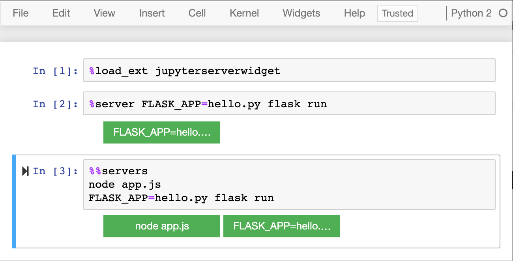

# Jupyter Server Widget

Jupyter Notebook %%magics and Widget to start and stop servers from a Cell


Usage
------

Load extension inside a Jupyter notebook:

```
%load_ext jupyterserverwidget
```

Add server commands with cell magic:

```
%server myserver1 --args myargs
```

```
%%servers
myserver1 --args myargs
myserver2 --args myargs
```

Click buttons to start them, click again to stop.


Examples
---------




Installation
------------

Install and activate dependencies:

- [ipywidgets](https://github.com/jupyter-widgets/ipywidgets)

Then:

    $ pip install jupyter_server_widget
